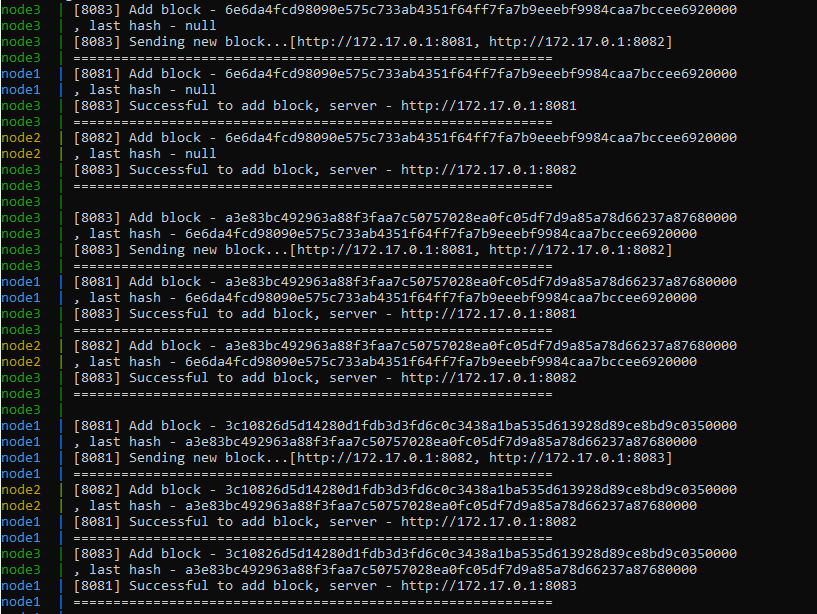

# PolyChain
Морозов Иван, группа 3530901/90202
## Гайд
При использовании Docker:
- Клонировать репозиторий: ```git clone https://github.com/ivannmm/PolyChain.git```
- Собрать проект и создать образ: ```docker build -t fierusoul/polychain_test .```
- Запушить образ: ```docker push fierusoul/polychain_test```
- Запустить Docker compose: ```docker-compose up```

## Результаты
